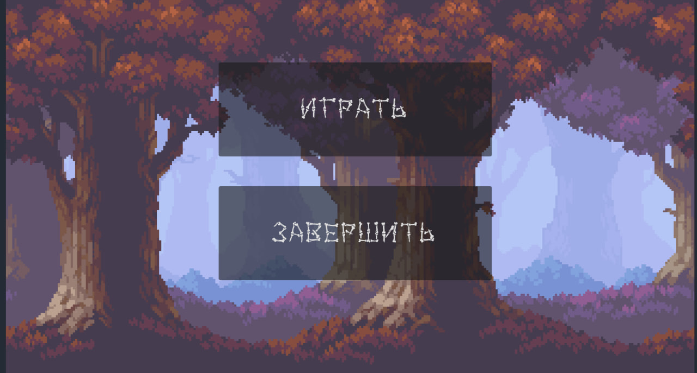
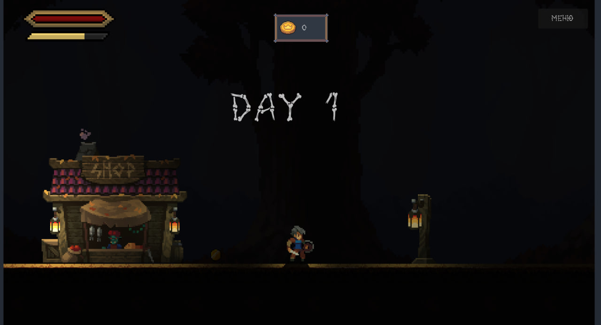
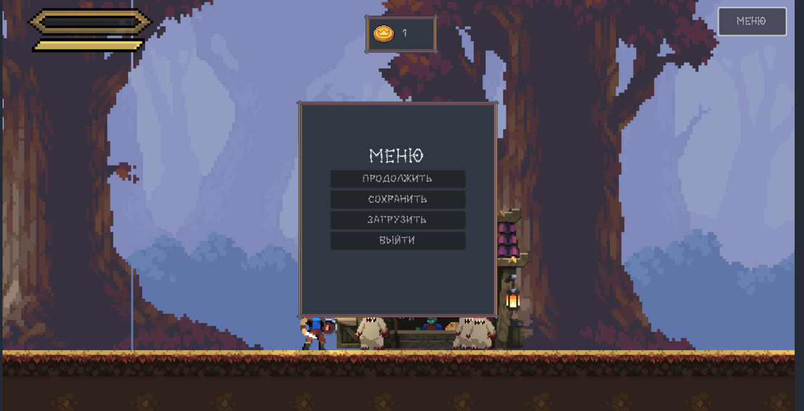

# 🎮 Платформер: Три дня выживания

2D survival-платформер, где нужно продержаться 3 дня против орд врагов-грибов. Создано на Godot 4.2 с использованием бесплатных пиксель-арт ассетов взятых с сайта [itch.io](https://itch.io/game-assets/free/tag-2d).

## 🔥 Особенности
- ⏳ Система дней — каждый день сложнее предыдущего
- ⚔️ Динамический бой с механикой регенерации
- 💰 Трофеи — собирайте монеты за убитых врагов
- 💾 Сохранение прогресса между сессиями
- 🎨 Стилизованная графика в пиксельном стиле

## 🕹 Управление
| Действие | Клавиатура 
|----------|------------|
| Движение | ← → / A D  |
| Блок     | Зажатый  shift при IDLE позиции|
| Атака    | Space      |
| Слайд   | Зажатый  shift при зодьбе или беге  |
| Бег  | Alt       |
| Пауза    | ESC        |

## 🎨 Внутренний дизайн 
Приветсвенная страница
Содержит две кнопки:
* играть - при нажатии начало игры 
* завершить - при нажатии полный выход с консоли 

Внутренний дизайн
Игра начинается с ночи первого дня, рядом с героем находится два объекта здание магазина и статичная лампа. Через несколько секунд начнет светать и героя начнут атаковать зловещие грибы. 

Герой должен сражатьтся с ними что бы прожить три ночи, с каждой ночью колличество появляющихся из обелисков зловещих грибов будет увеличиваться, они будут начинать становиться агрессивнее!😡

Игрок может получать монеты после победы над врагами, они служат неким трофеем за победу над врагом!

Внутри основного гемплея есть вкладка меню, где можно выйти из игры и сохранить текущий прогресс!💾 

Но если надоело, можно выйти из игры 😉

## 🎥 Видео геймплея 

_Ссылки на краткий тест игры:_
 
 ВК: https://vk.com/video567761446_456239627

Rutube: https://rutube.ru/video/62c37b76b360afbd190d58d8d282ca1d/

## ⚙️ Технологии и фишки
| Компонент | Реализация |
|-----------|------------|
| Движок | Godot 4.2 |
| Язык | GDScript 2.0 |
| Физика | Custom CharacterBody2D |
| Спавн | Object Pooling + Weighted Random |
| UI | Dynamic Health Bar |

# Пример кода: система регенерации
# UI/health.gd
var health := 100:
    set(value):
        health = clamp(value, 0, max_health)
        health_bar.value = health  # Обновление ProgressBar
        # Доп. логика анимаций...

func _on_health_regen_timeout() -> void:
    if health < max_health:
        health += 1  # Фиксированное восстановление

## Что же делает проект ососбенным?

* Механика "обелисков" как динамических точек спавна в определенное время 

* Баланс между сложностью и прогрессией 
* Атмосферный пиксель арт 
  
## Как установить проект? 🤔

### Windows
1. Скачайте архив Windows.zip
2. Распакуйте в любую папку
3. Запустите game.exe

### Linux
1. Скачайте Linux.zip
2. Распакуйте и дайте права на выполнение:
      chmod +x game.x86_64
   ./game.x86_64
